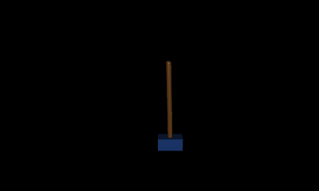

# robotics-playground

A full commit-to-robot pipeline built on Bazel: train a balancing policy in Python, package it as a content-addressed artifact, and run it in a C++ inference binary targeting ARM64 embedded Linux.



The policy is a simple linear controller trained with random search against a MuJoCo physics simulation. Every 3 seconds an angular impulse is applied to the pole — the policy corrects and returns to balance.

## The pipeline

```
Python training          Bazel artifact           C++ deployment
─────────────────        ──────────────           ───────────────────────
MuJoCo simulation   →   cartpole_policy.bin   →   cartpole_runner binary
random_search.py         (genrule output)          runs on ARM64 robot
                                                   no MuJoCo dependency
```

Training uses MuJoCo for high-fidelity physics. The robot binary uses a lightweight custom C++ physics engine with no external dependencies. The policy weights are the bridge — a Bazel `genrule` runs training at build time and captures the output as a tracked artifact.

## Quick start

Open in VS Code and click **Reopen in Container**. The devcontainer installs all tools (Bazel, clangd, pre-commit), generates `compile_commands.json` for IDE support, and sets up commit hooks automatically.

```bash
# Train the policy and run inference
bazel run //inference/cartpole_runner:cartpole_runner

# Render a 3-minute eval video with perturbations
bazel run //tools/training:eval_cartpole

# Run all tests
bazel test //...

# Build the OCI image for ARM64
bazel build //inference/cartpole_runner:cartpole_runner_image
```

## CI

Three jobs run on every push and pull request inside the ARM64 devcontainer:

1. **devcontainer** — builds and pushes `ghcr.io/<owner>/robotics-playground:devcontainer`
2. **lint** — `pre-commit run --all-files` (clang-format, ruff, buildifier)
3. **build-and-test** — `bazel test //...` + OCI image build, with BuildBuddy remote cache

Release builds trigger on version tags (`v*.*.*`): build → generate manifest → sign with RSA → upload artifacts to GitHub Releases.
